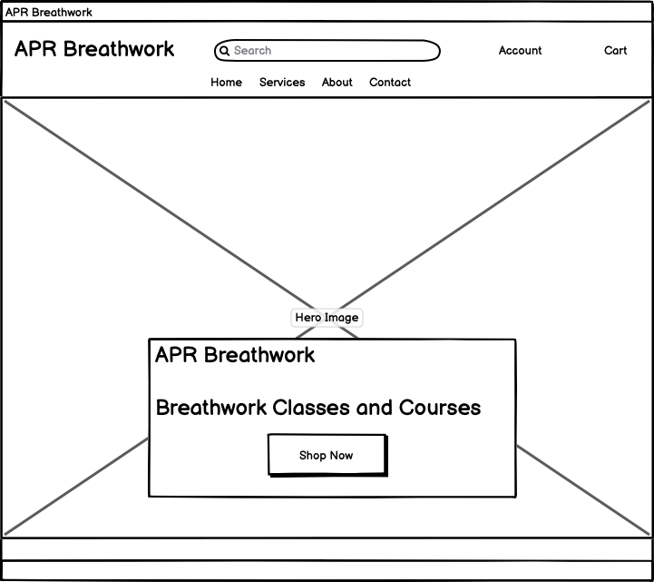
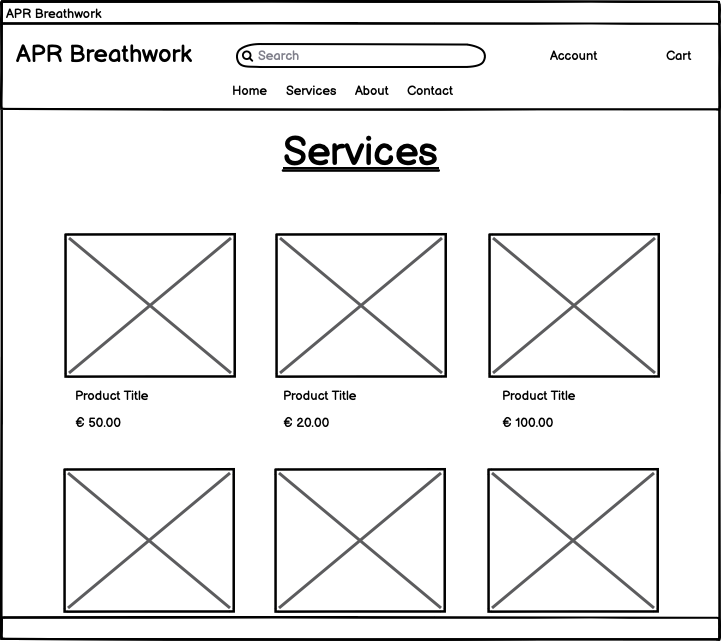
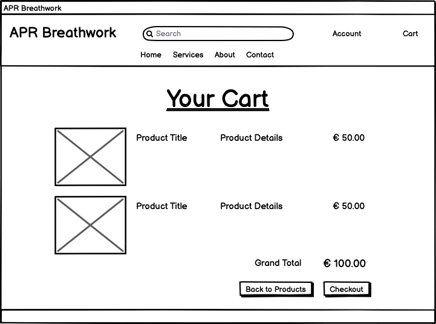

# APR Breathwork #

APR Breathwork is an ecommerce site designed to be used in the future by my partner, [**Aoife**](https://www.instagram.com/aoife.p.r/), who is currently in training to be a breathwork coach. After her studies she will be providing 1 to 1 and group breathwork classes both as 1 offs and 6 week courses. So she will be in need of a website where she can both advertise and sell these courses and classes

This platform will provide user's with a platform where they can:
- Read a bit about Aoife's background and qualifications
- Browse the various courses and classes she provides
- Pay for these classes and receive a link to attend live

The platform will also allow admins of the site to add edit and delete products (courses)

This project will use the Django framework for a MVC based application using Postgres databases to manage information.

[**Link to Live Site**](https://apr-breathwork.herokuapp.com/)

## Table of contents 

- [UX](#ux)
    - [Epics](#user-goals)
    - [User Stories](#user-stories)
- [Design Choices](#design-choices)
    - [Structure](#structure)
    - [Wireframes](#wireframes)
    - [Colors & Fonts](#colors)
- [Features](#features)
    - [Existing Features](#existing-features)
    - [Potential Future Feature](#future-features)
- [Marketing](#marketing)
- [Testing](#testing)
- [Deployment](#deployment)
    - [Local Deployment](#local-deployment)
    - [Heroku Deployment](#heroku)
- [Technologies](#technologies)
- [Credits](#credits)

## UX ##

### Epics ###

Epics were used to identify the broad features and design considerations before breaking them down into the indivual user stories used to design the site.
1. As a user I can browse and search the different products available on the store and read about the business
2. As a user I can register for an account with the site
3. As a user I can purchase available products
4. As an admin I can manage products on the store

### User Stories ###

User Stories are grouped based on the epic they were distilled from.

- Epic One: Browsing Content
    - As a user I can view a product list showing all available courses
    - As a user I can view individual products for all the details
    - As a user I can view and select available times/dates for the class I want
    - As a user I can search for specific products I am looking for
    - As a user I can read additional information about the business

- Epic Two: User Accounts
    - As a user I can register for an account to save my details
    - As a user I can log in and out of my account
    - As a user I can view my order history when logged in

- Epic Three: Accepting payment
    - As a user I can view items in my cart
    - As a user I can move my cart items to checkout for payment
    - As a user I can securely provide payment details to pay for items in my cart

- Epic Four: Admin controls
    - As a site admin I can add new products to the store
    - As a site admin I can edit existing product details
    - As a site admin I can delete products from the store

## Design Choices ##

### Structure ###

Below you will find the structure and models that are used in the database for this project. Diagram was created using [**DrawSQL**](https://drawsql.app/)

|   | Products Model  |   |
|---|---|---|
| id  | IntegerField  | OnetoMany (ProductVariants)  |
| name  | CharField  |   |
| description | TextField  |  |
| duration  | DurationField  |   |
| price  | DecimalField  |   |
| image_url  | URLField  |   |
| image  | ImageField  |   |
| requires_signup  | BooleanField  |   |

|   | ProductVariant Model  |   |
|---|---|---|
| id  | IntegerField  |   |
| product  | ForeignKey  | ManytoOne (ProductID) |
| date | DateField  |  |
| time  | TimeField  |   |
| attendance_limit  | IntegerField  |   |
| places_sold  | IntegerField  |   |
| meeting_invite_link  | URLField  |   |

|   | Order Model  |   |
|---|---|---|
| id  | IntegerField  |   |
| order_number  | IntegerField  |   |
| full_name | CharField  |  |
| email  | EmailField  |   |
| phone  | CharField  |   |
| date  | DateField  |   |
| grand_total  | DecimalField  |   |
| user_profile  | ForeignKey  | ManytoOne (UserProfileID) |

|   | OrderLineItem Model  |   |
|---|---|---|
| id  | IntegerField  |   |
| order  | ForeignKey  | ManytoOne (OrderID) |
| product | ForeignKey  | ManytoMany (ProductID) |
| line_item_total  | Decimal  |   |

|   | UserProfile Model  |   |
|---|---|---|
| id  | IntegerField  |   |
| user  | ForeignKey  | OnetoOne (AuthUserID) |
| paid_member_from | DateField  |  |
| is_paid_member | BooleanField  | Default False  |

`is_paid_member` is set to True if the user purchases a multi session course to access replays of classes (Not available for once offs) Gets set back to False after set amount of time has elapsed since `paid_member_from`.

Some additional models were added later in production to solve some other obstacles. The CourseInfo and Urls models were used to store the actual course information as long form courses require the live classes to be uploaded to the site the be rewatchable afterwards. This was done by saving each course and pairing it with Urls for each class which can be iterated on to output them all to a page gated by checks to make sure the user has bought the course.

|   | CourseInfo Model  |   |
|---|---|---|
| id  | IntegerField  |   |
| course  | OnetoOneField  | Products |
| variant | ForeignKey  | ProductVariant |

|   | Urls Model  |   |
|---|---|---|
| id  | IntegerField  |   |
| course  | ForeignKey  | CourseInfo |
| class_no | IntegerField  |  |
| url | URLField  |  |

A small model was also made to hold about us information in an editable format. The model is limited to a single entry that can be updated.

|   | AboutUs Model  |   |
|---|---|---|
| id  | IntegerField  |   |
| content  | Charfield  |  |
| imageurl | UrlField  |  |
| image | ImageField  |  |

### Wireframes ###

Wireframes have been made for desktop, tablet and mobile versions of each page of the site. Links to each can be found below. Wireframes were created using [**Balsamiq**](https://balsamiq.com/wireframes/)

In most cases mobile and tablet wireframes' design were identical save for more or less padding between items. Therefore they have been grouped together in some instances.

All wireframes can be viewed in these folders for [Desktop Wireframes](docs/design/wireframes/desktop-wireframes) and [Mobile Wireframes](docs/design/wireframes/mobile-wireframes/)

### Colors & Fonts ###

Main colors chosen for site (Yellow and Brown/Grey) were chosen to match current logo and aesthetic of her social media and personal site.

[**Coolors.co**](https://coolors.co/) was then used to generate a red/green/blue tone to match which could be used for warnings and alerts on the site. These will be used along with a clean white background.

## Features ##

### Existing Features ###

- User authentication, registration and sign in with Django allauth.
- Header navigation allowing for searching of products by title or description as well as filtering by category using menu items.
- Products page displaying list of products on store. Page can be filtered using search and category queries to narrow results on page.
- Product detail page for each product allowing users to view more info about courses such as description, duration and available dates/times.
- Long form courses which allow users to return to the site after live classes to view replys require an account before they can be purchased. Page redirects to sign in on these details pages if no account detected.
- Users given options of any available date time combos to purchase. When a variant is bought the places sold for that variant increments and locks product once places sold = attendance limit.
    - Each date/time combo is a variant which can be purchased only once at a time to prevent doubling up on same date.
    - Google meet (how classes are delivered) has a 100 participant limit on their video calls so variables given max limit or 100 that can be purchased
    - Limit can be lowered for 1 on 1 classes when creating variants.
- Store admins have extra options in nav and product details pages allowing them to create now products and variants or edit/delete existing ones.
    - When creating products can set attendance limit, assign a google meet link for class, set time/dates for variants and set wheether an account is required to purchase a given product.
- Cart stored in user session to save cart if user navigates away from store without purchasing items.
- Secure card checkout using Stripe.
- Confirmation emails sent to customer when order is completed with link to join session.
- User Profile page with:
    -  Past orders with links to their meet links and order confirmation pages.
    - Profile Summary
    - Link to long form course content if available. (Uploaded by staff after each classes)
- Long form courses have page to display recorded videos of sessions for review by students. Videos uploaded to youtube and embeded to save space and load strain on server.
- About us page with content editable from admin panel.
- Contact us page which allows users to message store owner. Send email to store email address with message and sender details

### Potential Future Features ###

## Marketing ##

I created a mockup of a potential Facebook page to be used in tandem with an Instagram account with similar content to be used to promote the business.

The welness industry and especially holistics is very popular on social media channels and is most likely the place where most potential customers will discover the business.

With its ability to inform and promote to customers constantly along with the opporunity to engage with followers on a 1 to 1 or 1 to many basis it is a powerful marketing tool.

The posts can be used to both directly promote the store by linking to the products page or a specific product.

They can also be used to provide value to followers by teaching and offering free tasters of what would be learned by purchasing the classes.

## Testing ##

### Manual Testing ###

### Automated Testing ###

### Bugs ###

## Deployment ##

### Local Deployment ###

### Heroku Deployment ###

## Technologies ##

### Languages ###

- [HTML](https://developer.mozilla.org/en-US/docs/Web/HTML)
- [CSS](https://developer.mozilla.org/en-US/docs/Web/CSS)
- [Python](https://www.python.org/)
- [Javascript](https://developer.mozilla.org/en-US/docs/Web/JavaScript)

### Libraries and Frameworks ###

- [Django](https://www.djangoproject.com/)
- [Bootstrap](https://getbootstrap.com/)
- [JQuery](https://jquery.com/)
- [Font Awesome](https://fontawesome.com/)
- [CKEditor](https://pypi.org/project/django-ckeditor-updated/)
- [Crispy Forms](https://django-crispy-forms.readthedocs.io/en/latest/)

### Other ###
- [Stripe](https://stripe.com/) for payment processing
- [Amazon AWS](https://aws.amazon.com/) for storage
- [Heroku](https://dashboard.heroku.com/) for server hosting
- [PostgreSQL](https://www.postgresql.org/) for database

## Credits ##

A big thanks as always to [Simen](https://dehlin.dev/) for coaching me through this project and offering very useful tips and suggestions on how to improve and elevate it.

A thanks also to my girlfriend Aoife for both helping me with the content for the site and hearing me out as I talk through the problems she has know knowledge of and even less interest in.

