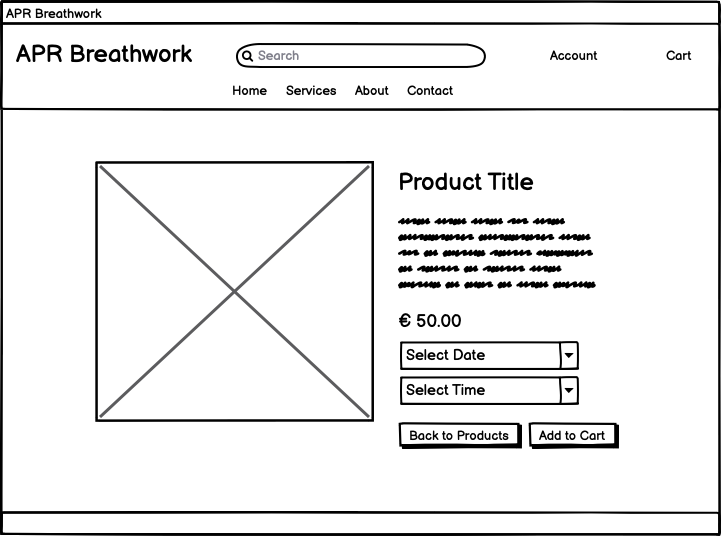
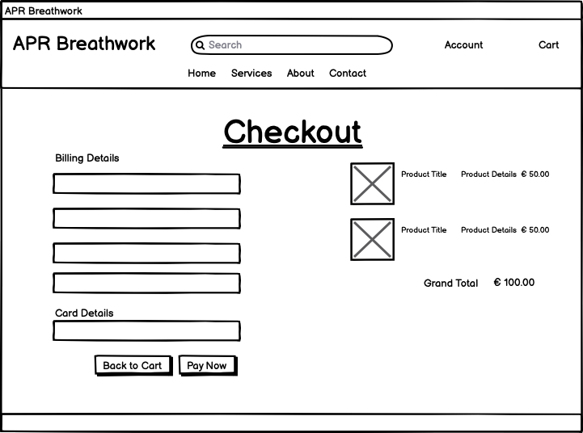
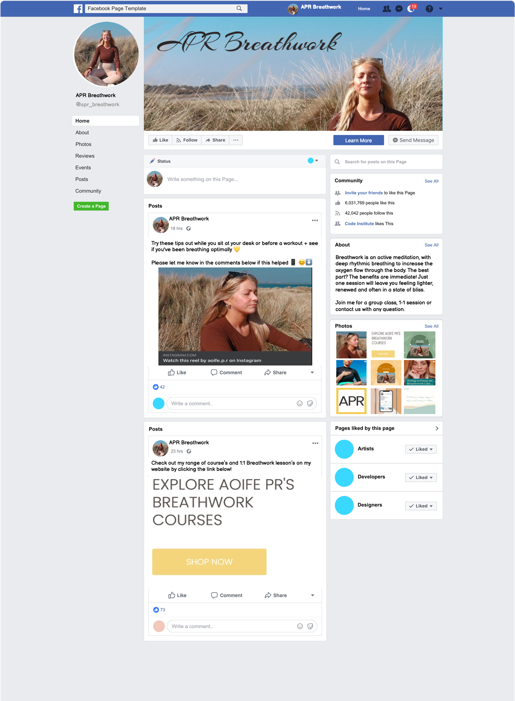
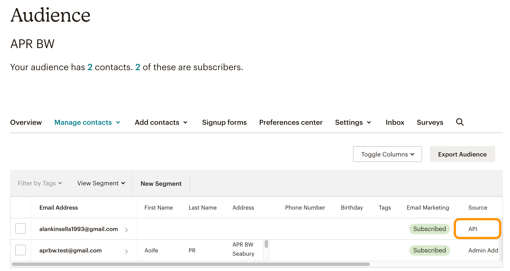
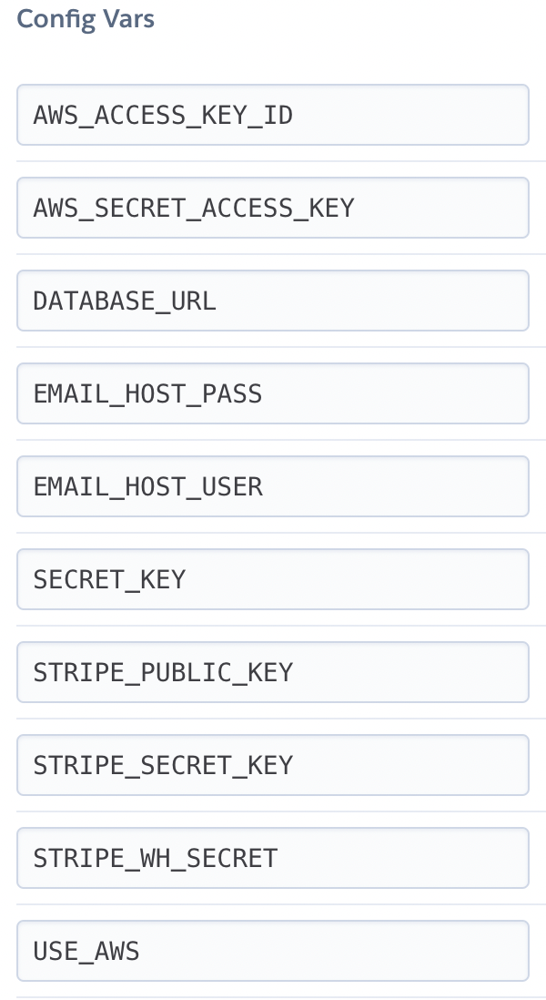

# APR Breathwork #

APR Breathwork is an ecommerce site designed to be used in the future by my partner, [**Aoife**](https://www.instagram.com/aoife.p.r/), who is currently in training to be a breathwork coach. After her studies she will be providing 1 to 1 and group breathwork classes both as 1 offs and 6 week courses. So she will be in need of a website where she can both advertise and sell these courses and classes

This platform will provide user's with a platform where they can:
- Read a bit about Aoife's background and qualifications
- Browse the various courses and classes she provides
- Pay for these classes and receive a link to attend live

The platform will also allow admins of the site to add edit and delete products (courses)

This project will use the Django framework for a MVC based application using Postgres databases to manage information.

[**Link to Live Site**](https://apr-breathwork.herokuapp.com/)

## Table of contents 

- [UX](#ux)
    - [Epics](#user-goals)
    - [User Stories](#user-stories)
- [Design Choices](#design-choices)
    - [Structure](#structure)
    - [Wireframes](#wireframes)
    - [Colors & Fonts](#colors)
- [Features](#features)
    - [Existing Features](#existing-features)
    - [Potential Future Feature](#future-features)
- [Marketing](#marketing)
- [Testing](#testing)
- [Deployment](#deployment)
    - [Local Deployment](#local-deployment)
    - [Heroku Deployment](#heroku)
- [Technologies](#technologies)
- [Credits](#credits)

<a name="ux"></a>

## UX ##

<a name="user-goals"></a>

### Epics ###

Epics were used to identify the broad features and design considerations before breaking them down into the indivual user stories used to design the site.
1. As a user I can browse and search the different products available on the store and read about the business
2. As a user I can register for an account with the site
3. As a user I can purchase available products
4. As an admin I can manage products on the store

<a name="user-stories"></a>

### User Stories ###

User Stories are grouped based on the epic they were distilled from.

- Epic One: Browsing Content
    - As a user I can view a product list showing all available courses
    - As a user I can view individual products for all the details
    - As a user I can view and select available times/dates for the class I want
    - As a user I can search for specific products I am looking for
    - As a user I can read additional information about the business

- Epic Two: User Accounts
    - As a user I can register for an account to save my details
    - As a user I can log in and out of my account
    - As a user I can view my order history when logged in

- Epic Three: Accepting payment
    - As a user I can view items in my cart
    - As a user I can move my cart items to checkout for payment
    - As a user I can securely provide payment details to pay for items in my cart

- Epic Four: Admin controls
    - As a site admin I can add new products to the store
    - As a site admin I can edit existing product details
    - As a site admin I can delete products from the store

## Design Choices ##

<a name="structure"></a>

### Structure ###

Below you will find the structure and models that are used in the database for this project. Diagram was created using [**DrawSQL**](https://drawsql.app/)


|   | Products Model  |   |
|---|---|---|
| id  | IntegerField  | OnetoMany (ProductVariants)  |
| name  | CharField  |   |
| description | TextField  |  |
| duration  | DurationField  |   |
| price  | DecimalField  |   |
| image_url  | URLField  |   |
| image  | ImageField  |   |
| requires_signup  | BooleanField  |   |

|   | ProductVariant Model  |   |
|---|---|---|
| id  | IntegerField  |   |
| product  | ForeignKey  | ManytoOne (ProductID) |
| date | DateField  |  |
| time  | TimeField  |   |
| attendance_limit  | IntegerField  |   |
| places_sold  | IntegerField  |   |
| meeting_invite_link  | URLField  |   |

|   | Order Model  |   |
|---|---|---|
| id  | IntegerField  |   |
| order_number  | IntegerField  |   |
| full_name | CharField  |  |
| email  | EmailField  |   |
| phone  | CharField  |   |
| date  | DateField  |   |
| grand_total  | DecimalField  |   |
| user_profile  | ForeignKey  | ManytoOne (UserProfileID) |

|   | OrderLineItem Model  |   |
|---|---|---|
| id  | IntegerField  |   |
| order  | ForeignKey  | ManytoOne (OrderID) |
| product | ForeignKey  | ManytoMany (ProductID) |
| line_item_total  | Decimal  |   |

|   | UserProfile Model  |   |
|---|---|---|
| id  | IntegerField  |   |
| user  | ForeignKey  | OnetoOne (AuthUserID) |
| paid_member_from | DateField  |  |
| is_paid_member | BooleanField  | Default False  |

`is_paid_member` is set to True if the user purchases a multi session course to access replays of classes (Not available for once offs) Gets set back to False after set amount of time has elapsed since `paid_member_from`.

Some additional models were added later in production to solve some other obstacles. The CourseInfo and Urls models were used to store the actual course information as long form courses require the live classes to be uploaded to the site the be rewatchable afterwards. This was done by saving each course and pairing it with Urls for each class which can be iterated on to output them all to a page gated by checks to make sure the user has bought the course.

|   | CourseInfo Model  |   |
|---|---|---|
| id  | IntegerField  |   |
| course  | OnetoOneField  | Products |
| variant | ForeignKey  | ProductVariant |

|   | Urls Model  |   |
|---|---|---|
| id  | IntegerField  |   |
| course  | ForeignKey  | CourseInfo |
| class_no | IntegerField  |  |
| url | URLField  |  |

A small model was also made to hold about us information in an editable format. The model is limited to a single entry that can be updated.

|   | AboutUs Model  |   |
|---|---|---|
| id  | IntegerField  |   |
| content  | Charfield  |  |
| imageurl | UrlField  |  |
| image | ImageField  |  |


If considered earlier in development the UserProfiles model could have been given a way to house enrolled courses to save some checks that are currently done in views to verify if a user can view the long form course page content.

<a name="wireframes"></a>

### Wireframes ###

Wireframes have been made for desktop, tablet and mobile versions of each page of the site. Links to each can be found below. Wireframes were created using [**Balsamiq**](https://balsamiq.com/wireframes/)

In most cases mobile and tablet wireframes' design were identical save for more or less padding between items. Therefore they have been grouped together in some instances.







All wireframes can be viewed in these folders for [Desktop Wireframes](docs/design/wireframes/desktop-wireframes) and [Mobile Wireframes](docs/design/wireframes/mobile-wireframes/)

<a name="colors"></a>

### Colors & Fonts ###

Main colors chosen for site (Yellow and Brown/Grey) were chosen to match current logo and aesthetic of her social media and personal site.

[**Coolors.co**](https://coolors.co/) was then used to generate a red/green/blue tone to match which could be used for warnings and alerts on the site. These will be used along with a clean white background.


<a name="features"></a>

## Features ##

<a name="existing-features"></a>

### Existing Features ###

- User authentication, registration and sign in with Django allauth.
- Header navigation allowing for searching of products by title or description as well as filtering by category using menu items.
- Products page displaying list of products on store. Page can be filtered using search and category queries to narrow results on page.
- Product detail page for each product allowing users to view more info about courses such as description, duration and available dates/times.
- Long form courses which allow users to return to the site after live classes to view replys require an account before they can be purchased. Page redirects to sign in on these details pages if no account detected.
- Users given options of any available date time combos to purchase. When a variant is bought the places sold for that variant increments and locks product once places sold = attendance limit.
    - Each date/time combo is a variant which can be purchased only once at a time to prevent doubling up on same date.
    - Google meet (how classes are delivered) has a 100 participant limit on their video calls so variables given max limit or 100 that can be purchased
    - Limit can be lowered for 1 on 1 classes when creating variants.
- Store admins have extra options in nav and product details pages allowing them to create now products and variants or edit/delete existing ones.
    - When creating products can set attendance limit, assign a google meet link for class, set time/dates for variants and set wheether an account is required to purchase a given product.
    - Create product/variant page uses JQuery and a button to dynamically change between two options with a single view. POSTing different parameters through url for each.
- Cart stored in user session to save cart if user navigates away from store without purchasing items.
- Secure card checkout using Stripe.
- Confirmation emails sent to customer when order is completed with link to join session.
- User Profile page with:
    -  Past orders with links to their meet links and order confirmation pages.
    - Profile Summary
    - Link to long form course content if available. (Uploaded by staff after each classes)
- Long form courses have page to display recorded videos of sessions for review by students. Videos uploaded to youtube and embeded to save space and load strain on server.
- About us page with content editable from admin panel.
- Contact us page which allows users to message store owner. Send email to store email address with message and sender details


<a name="future-features"></a>

### Potential Future Features ###

- Logged in customers currently do not have a way to edit their username/email. A form similar to checkout for less payment section could be used to edit these from profile page.
- Youtube URL upload currently requires the url to be manually edited to contain the `/embed/` instead of `/watch/v=` param. This could be managed better by allowing regular url upload and cleaning the url in the view before passing it to the template.
- Email system is pretty limited at the moment. With more work and some extra models staff could be given the ability to create and edit email templates before they are sent out. Email formatting is also quite basic in current form.

## Marketing ##
<a name="marketing"></a>

I created a mockup of a potential Facebook page to be used in tandem with an Instagram account with similar content to be used to promote the business.

The welness industry and especially holistics is very popular on social media channels and is most likely the place where most potential customers will discover the business.

With its ability to inform and promote to customers constantly along with the opporunity to engage with followers on a 1 to 1 or 1 to many basis it is a powerful marketing tool.



The posts can be used to both directly promote the store by linking to the products page or a specific product.

They can also be used to provide value to followers by teaching and offering free tasters of what would be learned by purchasing the classes.

A Newsletter signup form exists in the Footer of all pages allowing users to sign up to a newsletter. This subscribes users to a list with MailChimp which can be used to target users with deals and updates in the future. Mailchimp automatically filters fake and repeat signups and adds valid emails to the contacts list.

An email added using this API can be seen below which confirms the feature functions as intended.



<a name="testing"></a>

## Testing ##

Site passes through [W3 Validator](https://validator.w3.org/nu/?doc=https%3A%2F%2Fapr-breathwork.herokuapp.com%2F) showing a single error for duplicated id `user-options` in the header/nav section which is due to both mobile and desktop versions loading though only one is displayed at a time.

No CSS errors present when passing through [W3C Validation Service](https://jigsaw.w3.org/css-validator/validator?uri=https%3A%2F%2Fapr-breathwork.herokuapp.com%2F&profile=css3svg&usermedium=all&warning=1&vextwarning=&lang=en).

Testing based on user stories:
- Epic One: Browsing Content
    - As a user I can view a product list showing all available courses
        - Main products page displays full list of available products. A promenant button on the homepage directs users to this page and can also be reached from nav options. **Passed**
    - As a user I can view individual products for all the details
        - Upon selecting any product the user is brough to a detailed view of this product. **Passed**
    - As a user I can view and select available times/dates for the class I want
        - Each product detail page provides dropdown forms showing all available class dates and times for each product. Times are dynamic and change dependant on date selected. **Passed**
    - As a user I can search for specific products I am looking for
        - A search bar is present in the header of all pages which can be used to search products based on both title and description. **Passed**
    - As a user I can read additional information about the business
        - Site includes and about us page editable and updateable by store admins. **Passed**

- Epic Two: User Accounts
    - As a user I can register for an account to save my details
        - Optional profiles can be created by users to save their order history as well as provide links to their past classes. Profiles are required for some content on the site. **Passed**
    - As a user I can log in and out of my account
        - Header interface contains easily accessed log in/ register and log out options depending on current status.**Passed**
    - As a user I can view my order history when logged in
        - Profile page contains an order history which redirects to the confirmation page of that order. **Passed**

- Epic Three: Accepting payment
    - As a user I can view items in my cart
        - Cart items are saved in session so persist when site is closed. Upon adding an item to cart a popup message provides a link to the cart page to review all contents. A cart icon is also present on every page showing a running total cost and proving an easy way to reach the cart page. **Passed**
    - As a user I can move my cart items to checkout for payment
        - Cart items can be removed from cart page or user can move from cart to checkout for payment and order creation. **Passed**
    - As a user I can securely provide payment details to pay for items in my cart
        - Checkout page contains a secure and validated form field for inputting card details after which payment is captured through stripe and their order is created. **Passed**

- Epic Four: Admin controls
    - As a site admin I can add new products to the store
        - When logged in as an admin the user can select add product/variant from their account menu in the header where they can add a product or a variant for an eisting product. If a product is created the user is immediately sent to the page to creat a variant too. **Passed**
    - As a site admin I can edit existing product details
        - When logged in as an admin product detail pages hold links to allow the user to edit the current product or to select a variant of the product to edit the variant. **Passed**
    - As a site admin I can delete products from the store
        - When logged in as an admin product detail pages hold links to allow the user to delete the current product or to select a variant of the product to edit the variant. **Passed**


### Manual Testing ###

Testing carried out by friends and family as well as myself
- Responsiveness
    - Site has been tested on a variety of devices both desktop and mobile to ensure all pages are responsive. No elements spill out of their boundaries or off screen. CKEditor proved particularly stubborn in getting it to conform to its parent elements. Still eeds some work to stay in bounding box.
- Navigation
    - Navigation for the site is simple and straightforward. All buttons and links provide feedback to the user and link to the correct pages. All post titles and usernames link to their correspoonding pages as is expected by users.
- Accessibility
    - All colours for elements have been selected and tuned to ensure that sufficient contrast is seen throughout the site. Therefore all icons, text, elements on the site should be easily seen and read. All actions on site provide feedback through Django messages to ensure user is aware of any actions they take.
- Security
    - Options to edit and delete data are only displayed to staff members, ie If a user is not staff they do not see the edit/delete options. If a user manually navigates to a url they should not have access to checks are in all necessary views to authenticate user before loading the page. User is information of why they don't have access


### Automated Testing ###

Unit tests created for some apps. Need to be completed for cart and checkout apps still.

Tests were created for views models and forms for each app to confirm pages are giving a correct response using the correct templates and funcationality is as intended.


### Bugs ###

During development the project was managed through GitHub's issues and projects features. Apps were created in their own branches and then merged to main.(Branches have not been deleted for marking purposes and will be removed afterwards as they are stale) Bugs were logged in the GitHub issues, some notable additional additional bugs were:

- Selecting date and time on product detail page is not manditory resulting in error if product is added to cart without time/date selected. Fixed by making fields mandatory.
- `IntegrityError at /admin/checkout/order/3/delete/ NOT NULL constraint failed: checkout_order.total`
When deleting an order, total becomes null despite being a required field. Fixed by resetting total to zero after clearing.
- When product variables being added to the cart used `get_object_or_404` but only validated the variant by its date and time fields not the product! This slipped by for a long time as I had not created variants with overlapping times (Shouldn't happen anyway as only one class can be run at a time but still) Adding an additional param to the `get_object_or_404` to also filter by the product solved this.
- If a customer has purchased a long form course but the course info has not been added yet (the videos of courses would not be added until after the first class) the profile page could not load the details even though user has paid for course. This was because they view was trying to fetch non existant data. This was fixed by adding an if statement to check if the content is created yet as there will be times when no content is available yet


<a name="deployment"></a>

## Deployment ##


This project is deployed to [Heroku](https://www.heroku.com/) which is where it is available to view publicly in a [Live Environment](https://apr-breathwork.herokuapp.com/). The project was developed with Github serving as host for my Git respository. This project can be deployed locally using and IDE or remote to a hosting platform such as Heroku.

For this project to work you will need an account on [Amazon AWS](https://aws.amazon.com/) with an [S3 bucket](https://docs.aws.amazon.com/AmazonS3/latest/userguide/UsingBucket.html) set up in order to store static files and uploaded media files.

Your will also need to set up a [Stripe account](https://dashboard.stripe.com/) for free and use it to get your Stripe Puclic and Secret keys which are needed to processes payments.

<a name="local-deployment"></a>

### Local Deployment ###

These are the steps needed in order to deploy this project locally through an IDE such as gitpod:

1. Clone the project. Navigate to the repository, above the window housing all of the application's files there is a code button which drops down into a clone window providing a link to clone the project. In your IDE terminal type the following using the link provided.
    ```
    git clone https://github.com/ItsAlanK/apr-breathwork.git
    ```
2. Install the modules required for the application to run using the ```requirements.txt``` file. You can do this with the following command in your terminal.
    ```
    pip3 install -r requirements.txt
    ```
3. Create a file in your project root directory called ```env.py``` to store environment variables. These variables are referenced in ```settings.py``` and are used to set security keys and other sensitive information that should not be hardcoded into the project.
    ```
    DATABASE_URL = 'YOUR DB URL'
    STRIPE_PUBLIC_KEY = 'YOUR STRIPE PUBLIC KEY'
    STRIPE_SECRET_KEY = 'YOUR STRIPE SECRET KEY'
    SECRET_KEY = 'YOUR DJANGO SECRET KEY'
    DEVELOPMENT = 1
    ```
    Ensure you add this env.py file to your .gitignore file if you are pushing the project to a live repository to prevent leaking information. If you fail to do this, deactivate and change any keys stored in the file immediately.

    Your ```DATABASE_URL``` variable is not needed if you only intend to run on a local machine as the project uses a local database when debug is on however in a live environment this will be required. _(More on this in the live deployment)_
4.  Migrate the database models with the following terminal command

    ```
    python3 manage.py migrate
    ```
5. Create a superuser in order to access admin for site with the following command
    ```
    python3 manage.py createsuperuser
    ```
    And set up a username and password
6. Run the project with the following command:
    ```
    python manage.py runserver
    ```
    The terminal will provide you with the link to the server opened with this command.
7. To access the admin dashboard, add ```/admin``` to the end of the URL and user your superuser login details.


<a name="heroku"></a>

### Heroku Deployment ###

**NOTE** at the time of completing this project Heroku had issues deploying directly from GitHub and required using their CLI instead. More can be found about this process [here.](https://devcenter.heroku.com/articles/heroku-cli)

To deploy this project to Heroku to be used remotely:

1.  Create an account with [Heroku](https://www.herokuapp.com/) if needed. Create a new project and give it a name. 
2. Navigate to the resources page for your project and in the Addons search bar, search for **Heroku Postgres.** And select the free plan.
3. Navigate now to the settings page and click **reveal config vars.** Here we will set up most of the same variables from the `env.py` file. Copy over all of those same variables set in the local development section **EXCEPT:**
    - `DEVELOPMENT` which should not be on in the live enviroment so leaving it absent causes a Falsey result when checked for in settings.py.
    - Here is a full list of config vars required on Heroku
        
        - Note AWS access and secret access keys also needed as when not in development mode all static and media files are sent to AWS. You will also need to change the `AWS_STORAGE_BUCKET_NAME` in settings.py to your own bucket name.
        - `STRIPE_WH_SECRET` is not required at present as webhooks feature not complete
        - EMAIL variables are dependant on the email host you choose. Some email settings found in settings.py also must be changed to reflect your own hosts requirements.
    - `DATABASE_URL` which has been populated with the Heroku Postgres db URL already. This is what you can place in the env.py file now for the same variable. **Note** the project will still use a development server while `DEVELOPMENT` is active so in order to migrate models to the Heroku db you first will have to:
        - set `DEVELOPMENT = 0` in env.py. Then you can use the below command again and models will be sent to the live db.
        ````
        python3 manage.py migrate
        ````

        - Create another superuser for the live db by using the following command and setting login details.
        ```
        python3 manage.py createsuperuser
        ````
        - After this is done you can change DEVELOP back to 1 in env.py to turn debug back on and work off the local db. These steps will have to be repeated (except creating superuser) each time you make changes to your model to push them to the live db.
4.  Add your Heroku app URL to ALLOWED_HOSTS in your settings.py file
5.  Back in your Heroku settings, below config vars in the add buildpacks section you must add the "Python" buildpack.
6.  In your IDE confirm requirements.txt is up to date you using `pip freeze > requirements.txt` in the teminal.
7.  Push all changes to your github repository
8.  Back in Heroku navigate to the deploy page and link your GitHub account.
9.  Select the branch of your project to deploy click deploy branch Your project will deploy in a few moments and you will have a button to open your app.


<a name="technologies"></a>

## Technologies ##

### Languages ###

- [HTML](https://developer.mozilla.org/en-US/docs/Web/HTML)
- [CSS](https://developer.mozilla.org/en-US/docs/Web/CSS)
- [Python](https://www.python.org/)
- [Javascript](https://developer.mozilla.org/en-US/docs/Web/JavaScript)

### Libraries and Frameworks ###

- [Django](https://www.djangoproject.com/)
- [Bootstrap](https://getbootstrap.com/)
- [JQuery](https://jquery.com/)
- [Font Awesome](https://fontawesome.com/)
- [CKEditor](https://pypi.org/project/django-ckeditor-updated/)
- [Crispy Forms](https://django-crispy-forms.readthedocs.io/en/latest/)

### Other ###
- [Stripe](https://stripe.com/) for payment processing
- [Amazon AWS](https://aws.amazon.com/) for storage
- [Heroku](https://dashboard.heroku.com/) for server hosting
- [PostgreSQL](https://www.postgresql.org/) for database


<a name="credits"></a>

## Credits ##

A big thanks as always to [Simen](https://dehlin.dev/) for coaching me through this project and offering very useful tips and suggestions on how to improve and elevate it.

A thanks also to my girlfriend Aoife for both helping me with the content for the site and hearing me out as I talk through the problems she has know knowledge of and even less interest in.

